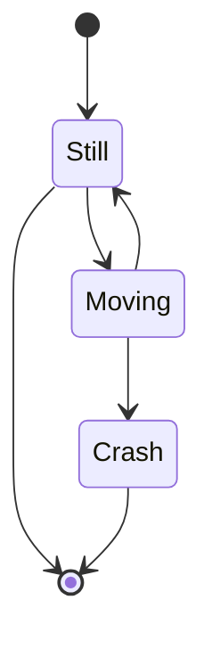

# Lesson-1

> You can use Google to find this information or this [FTC Documentation](https://ftctechnh.github.io/ftc_app/doc/javadoc/index.html)

## Setting Up An _OpMode_


```java
@TeleOp
public class Main extends OpMode {
    
    @Override
    public void init(){}
    
    @Override
    public void loop(){}
}
```


## Motor Methods

- `DcMotor.RunMode`: Controls the motor's run mode parameters
- 

## Servo Methods 

## Claw Methods
