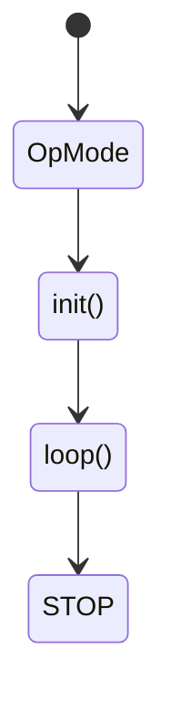

# Lesson-1

> You can use Google to find this information or this [FTC Documentation](https://ftctechnh.github.io/ftc_app/doc/javadoc/index.html)

## Setting Up An _OpMode_

These are the steps the Robot will go through:


The code part of it looks like this:
```java
@TeleOp
public class Main extends OpMode {
    
    @Override
    public void init(){}
    
    @Override
    public void loop(){}
}
```

- `@TeleOp`: Indicates that we are writing a program (`OpMode`) that we can later select on our driver hub.
- We then extend it to `OpMode` to inherit its properties and make an `OpMode` program of our own.
- Before the methods, you will have to create the motor and servo objects.
- Remember to place `@Override` above the void methods as we are coding a new program.
- In the `init()` method will be the initialization of objects that will be needed to run during the `loop()` stage.
  - Example: Using `hardwareMap` to connect the `DcMotor` object to the actual motor.
- In the `loop()` method will be the code that will have to continuously run to move the robot.
  - Example: `DcMotor` values that will change based on the joystick movement. 

>***NOTE*** : You don't have to manually import each class from the FTC packages/libraries, as it will add itself when you write the code

## Motor Methods

### init() Stage:

```java
@Override
public void init(){
    motor1 = hardwareMap.get(DcMotor.class, motor1);
    
    motor1.setMode(DcMotor.RunMode.RUN_TO_POSITION);
}
```

- `hardwareMap.get(DcMotor.class, deviceName)`: This will connect the object to the actual motor on the robot.
  - This is done through the control hub that connects everything together.
- `DcMotorObject.setMode(DcMotor.RunMode.mode)`: Sets the run mode for the motor.
  - Example: `DcMotor.RunMode.RUN_TO_POSITION`.
  >***NOTE*** : The `deviceName` has to be configured in the driver hub.

### loop() Stage

```java
@Override
public void loop(){
    motor1.setPower(motorSpeed);
}
```

- `DcMotorObject.setPower(double value(s))`: sets the speed at which the motor will spin at.
  >***NOTE*** : Motor power values range from **-1** to **1**.


## Servo Methods

### init() Stage

```java
@Override
public void init(){
    servo1 = hardwareMap.get(Servo.class, servo1);
}
```

- `hardwareMap.get(Servo.class, deviceName)`: This will connect the object to the actual motor on the robot.
  - This is done through the control hub that connects everything together.

### loop() Stage

```java
@Override
public void loop(){
    servo1.setPosition(0.335);
}
```

- `ServoObject.setPosition(double value(s))`: Sets the position of the servo/claw.
  >***NOTE*** : Servo position ranges from the values between **0** to **1**.

